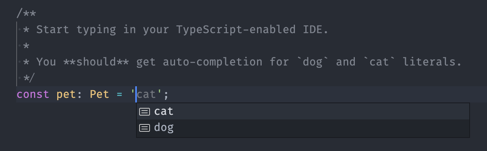

# typescript-string-and-literal-union

## Quiz

When a union type of a primitive type is combined with literal types, TypeScript loses all information about the combined literals. Thus, when such type is used in an IDE with autocompletion, no suggestions are made for the declared literals.

```ts
type Pet = 'dog' | 'cat' | string;
```



Try to fix the `Pet` type to support IDE autocompletion.

[](https://githubbox.com/CompassChina/quiz/tree/main/typescript-string-and-literal-union)
